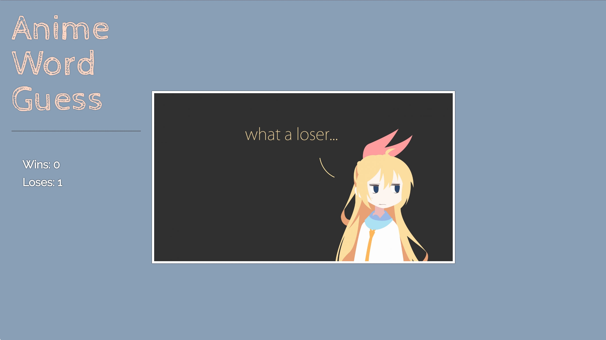

### Word-Guess-Game

# _JavaScript_Assignment_

The third  assignment of Columbia Coding Bootcamp. 

 

# Finished Product:

    
# Project Info:
- WARNING: **START button**: will play music  
    `(but if you're the weirdo that don't like the pretty music and is too lazy to shut off you sound -- there is an on/off music button at your bottom left -.-' )`

- **NEW GAME button**: will get you a new word and a new pretty background

- **RESET button**: will reset your score to zero, bring you back to the Welcome page with a new background and stop the music

 

- At the top left there is a hint image of what the anime is

- If you are not good at anime and just want to see flow of the game you can comment in line 303 of game.js to see the console.log() of the answers

- Watch out for the Incorrect key box `-- think of it as your health bar --` the more lives you lose the more red will grow in it

- Were you going to try to see if special characters and space bar will pick up in the game??  
    `-- HA! I already though of that and no it won't pick up XP`

 

- There are only 40 word in total and the words will not repeat

- BUT if by chance you LOVE this game so much that you do guess all 40 words `-- the game will not let you down --` it will automatically add all the words back in and you can play again.

## ENJOY!
    

# Assignment Word Guess Game (Challenge - Recommended)

1. Watch the demo

2. Choose a theme for your game! In the demo, we picked an 80s theme: 80s questions, 80s sound and an 80s aesthetic. You can choose any subject for your theme, though, so be creative!

3. Use key events to listen for the letters that your players will type.

4. Display the following on the page:

5. Press any key to get started!

6. Wins: (# of times user guessed the word correctly).

   * If the word is `madonna`, display it like this when the game starts: `_ _ _ _ _ _ _`.

   * As the user guesses the correct letters, reveal them: `m a d o _  _ a`.

7. Number of Guesses Remaining: (# of guesses remaining for the user).

8. Letters Already Guessed: (Letters the user has guessed, displayed like `L Z Y H`).

9. After the user wins/loses the game should automatically choose another word and make the user play it.
  
##### Word Guess Game Bonuses
1. Play a sound or song when the user guesses their word correctly, like in our demo.
2. Write some stylish CSS rules to make a design that fits your game's theme.
3. **HARD MODE:** Organize your game code as an object, except for the key events to get the letter guessed. This will be a challenge if you haven't coded with JavaScript before, but we encourage anyone already familiar with the language to try this out.
4. Save your whole game and its properties in an object.
5. Save any of your game's functions as methods, and call them underneath your object declaration using event listeners.
6. Don't forget to place your global variables and functions above your object.
   * Remember: global variables, then objects, then calls.
7. Definitely talk with a TA or your instructor if you get tripped up during this challenge.
